# MATLAB Battleship

## Purpose:
A recreation of Battleship using the Milton Bradley rule set.

## Code Overview:
The program is run through *main.m* which in turn runs a setup and calls menu(). From here, menu() will make calls to the other functions as necessary (such as makeBoard(), saveBoard(), playGame(), etc.).

### main()
Entry point to the game, prepares variables, and calls menu().

### menu()
Handles program navigation

#### menu( option 8 )
There is also **bTests.m** which can be called on the menu using *option 8* (not shown on screen). This will run the validity test on the boards included in *Test Boards* in accordance to the rule set.

### getInput() & Cord()
Used in tandem to get user input in traditional coordinates (A1, B4, C9, D10, etc.) and translate into matrix notation (boards are set up as matrices).

### makeBoard( *mode* )
Function varies depending on the mode, but will always check for board validity (checked through local **canPlace()**).
#### User
Asks user to select and place ships along the board.
#### CPU
Randomly assigns locations to ships.

### saveBoard()
Takes input board data type and saves it to the local *Boards* folder as the next "empty" numeral. For example, if there are 6 boards (numbered 0-5), then the current board will be saved as **b6.txt**.

### displayBoardOnly()
Takes input board and searches the local *Boards* folder for the corresponding board. The board is then plotted and labeled according to the board number (from the file name).

### playGame()
Game handler with different, albeit unused, modes. Calls board generation first (random if called from *quickplay*, otherwise user-selected for the user and random for the CPU). Variables for stat handling are also maintained.
The game loop will then run. So long as there is no winner, a new turn will run. Each turn the players select a target (random for the CPU) and the turn's operations are executed with feedback for any **hits** and **sunken ships**.
Game state is checked for victory at the end of each turn, and stats are displayed at the end of the game.

### displayGame()
Traverses the current state of the board matrices and plots them for display. Each segment is displayed through points and markers, with a blank (or blue space) for open water, a white X for misses (**sploosh**), a red X for hit spaces, and a black square for ship segments (which become visible for enemy ships when the entire ship is taken down).

## Gallery:
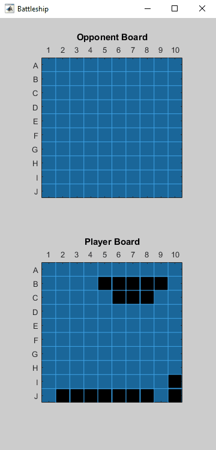

Gameplay

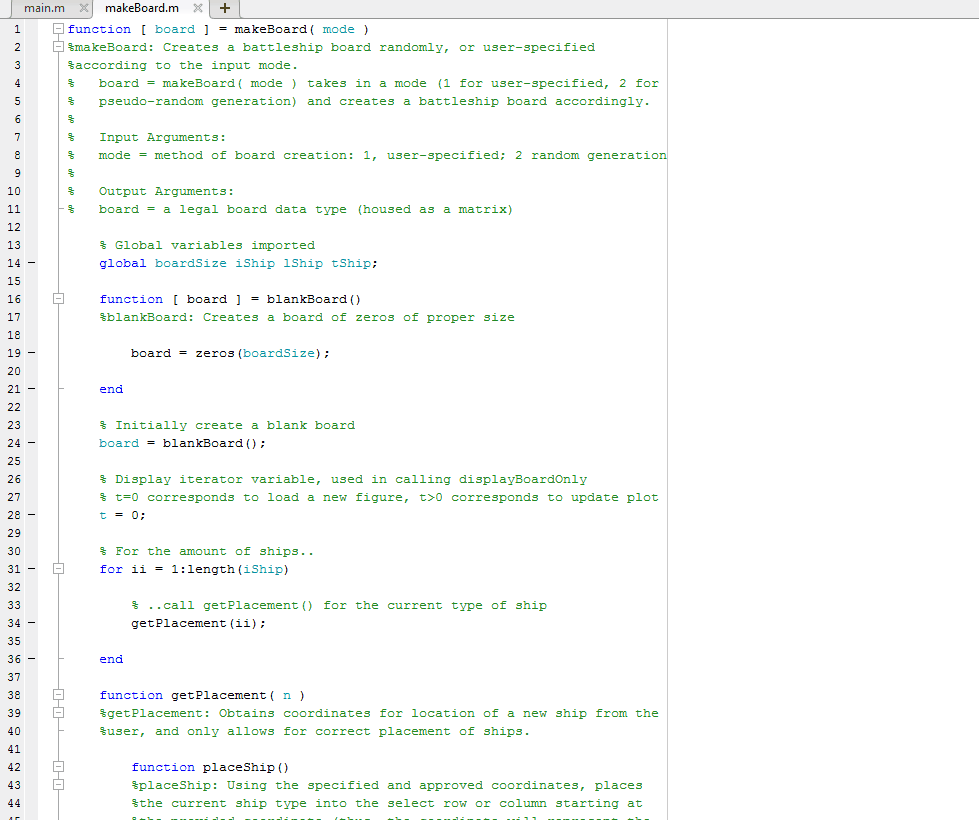

Commented Code

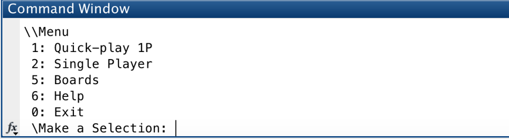

Main Menu

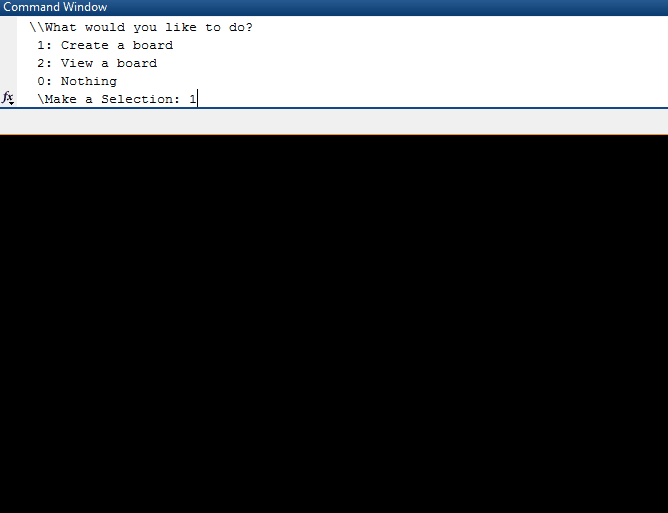

Board Setup

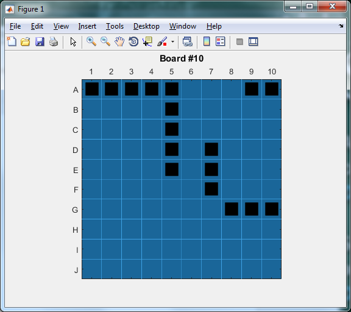

Example Board In-Game

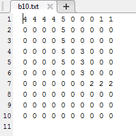

Example Board File

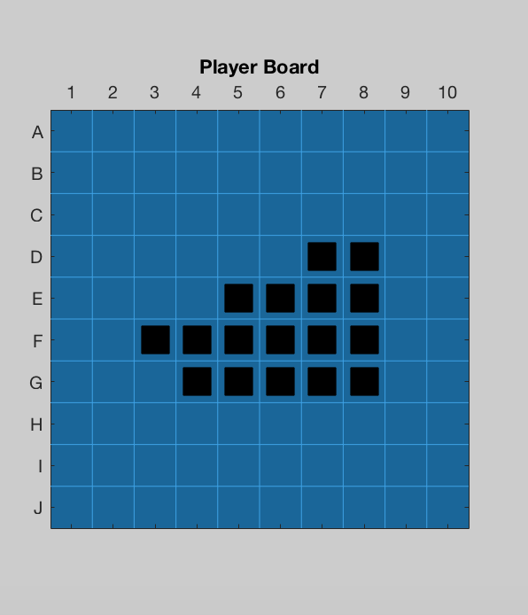

Example Game A Start

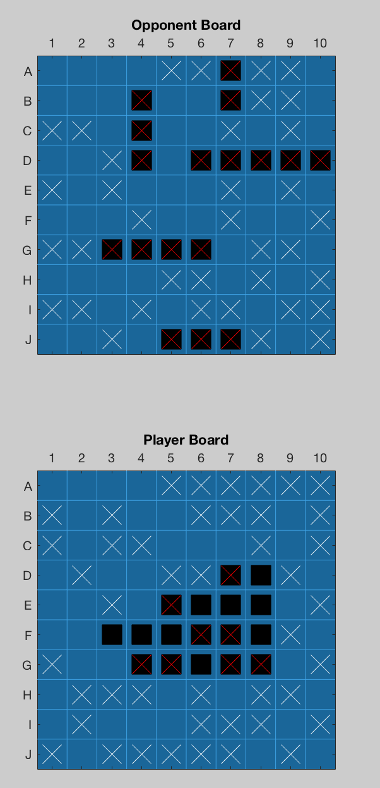

Example Game A End

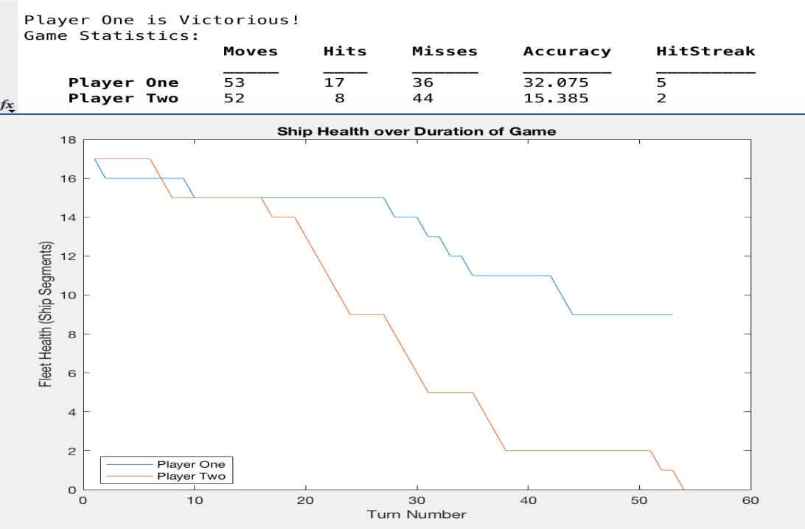

Example Game A Stats

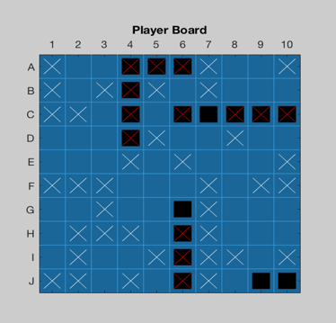

Example Game B Start

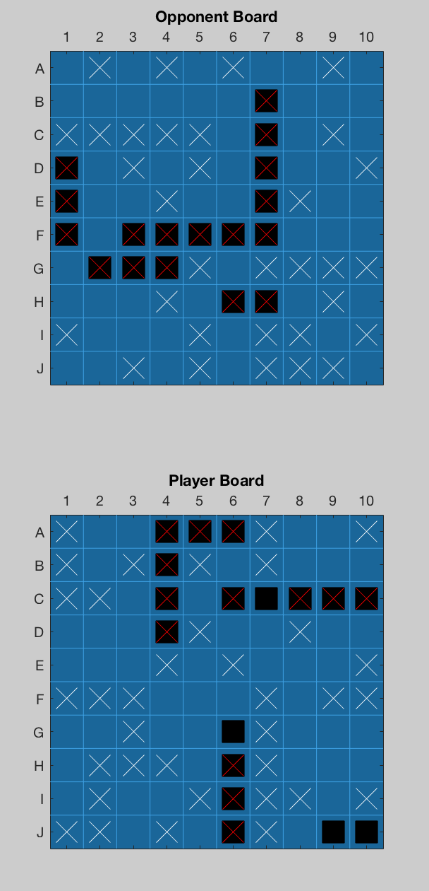

Example Game B End

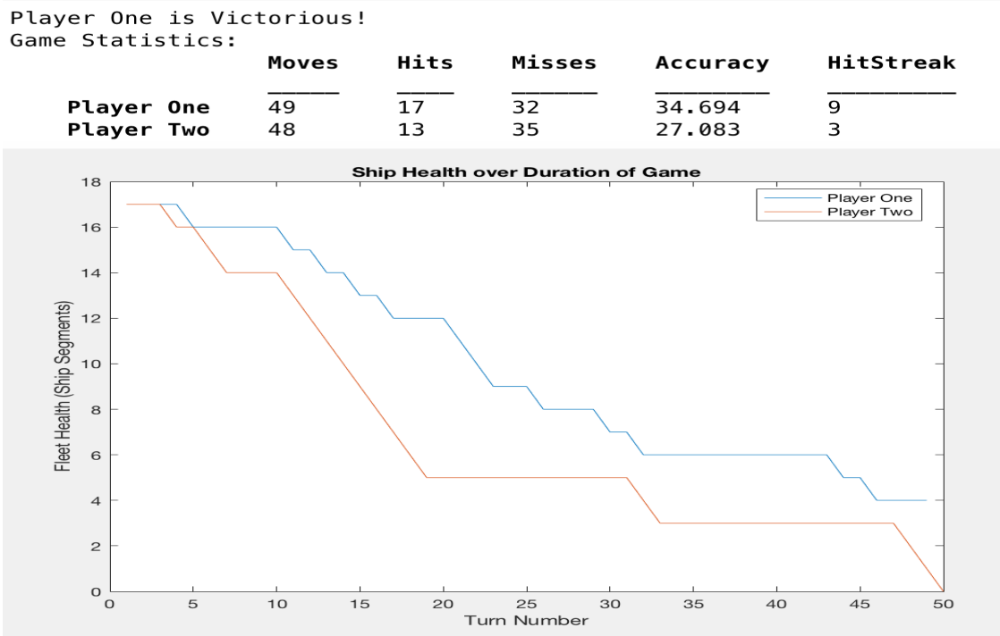

Example Game B Stats

